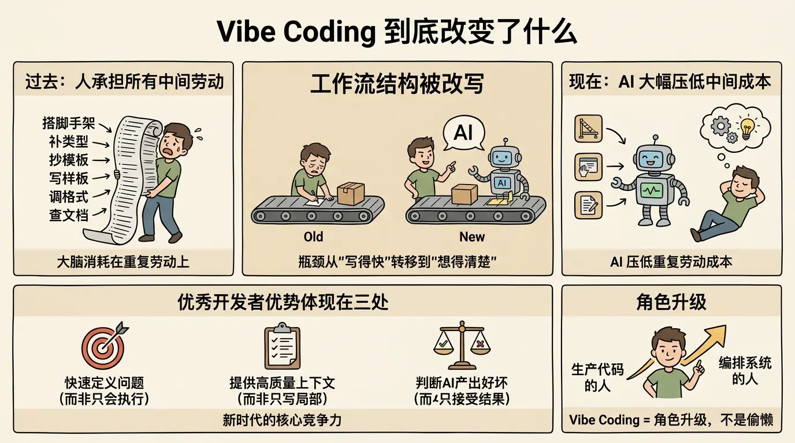

Vibe Coding 最重要的变化，不是代码生成速度提升了多少，而是开发过程中的工作流结构被改写了。

过去的开发流程里，绝大多数细节都要靠人自己显式实现。哪怕你已经想明白了功能目标，也仍然要亲手完成大量中间劳动：搭脚手架、补类型、抄模板、写样板、调格式、查文档、补测试、修边界。很多时候，工程师的大脑被消耗在知道该怎么做，但还得自己一点点做出来的重复劳动上。

AI 把这部分成本大幅压低了。

这意味着，开发的瓶颈开始从写得够不够快，转移到想得够不够清楚、说得够不够准确、验得够不够严格。

换句话说，优秀开发者的优势会越来越体现在三个地方：

1. 能否快速定义问题，而不是只会执行问题。
2. 能否提供高质量上下文，而不是只会写局部实现。
3. 能否判断 AI 产出哪里可用、哪里危险，而不是只会接受结果。

所以，Vibe Coding 本质上不是偷懒，而是一种角色升级。它要求开发者从生产代码的人，逐步转向编排系统的人。
