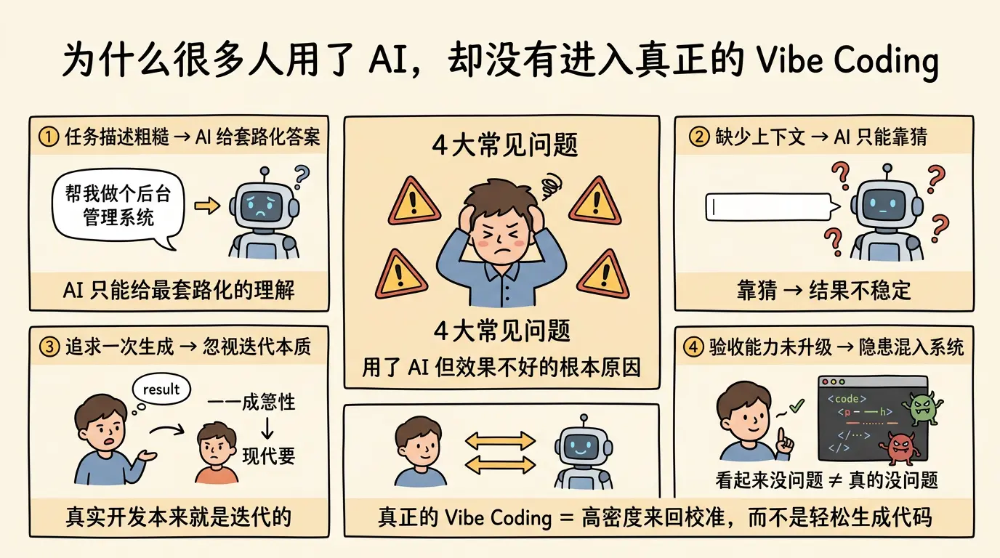

很多团队已经在用 AI 了，但实际体验并不好。常见感受通常是这样的：

- AI 看起来很聪明，但写出来的代码经常不符合项目现状。
- 一开始省了时间，后面花更多时间返工。
- 写 demo 很快，做真实业务却频繁跑偏。
- 回答很多，真正可落地的很少。
- 一旦项目复杂起来，AI 就开始自信胡说。

这不是因为 AI 没用，而是因为很多人把它当成了高级自动补全，却没有真正调整自己的工作方式。

最常见的问题有四个。

第一，任务描述过于粗糙。
一句帮我做个后台管理系统，帮我优化一下这个页面，帮我加个登录功能，在人的团队协作里都算模糊，更别说给 AI 了。AI 会尽力补全你的意图，但它补出来的，往往是它最常见、最平均、最套路化的理解，而不是你真正想要的那一个。

第二，缺少上下文。
AI 并不天然知道你的业务规则、已有架构、设计偏好、约定俗成和技术债。它只能基于你当前提供的信息去做最合理猜测。你给得少，它就只能猜；一旦靠猜，结果就不稳定。

第三，把一次生成当成目标。
很多人潜意识里，还在追求我说一句，AI 一次写完。但真实的软件开发本来就不是一次完成的。需求是在迭代中清晰的，设计是在反馈中收敛的，质量是在验证中建立的。AI 只是把这个过程加速了，并没有取消它。

第四，验收能力没有同步升级。
会让 AI 写，不等于会判断它写得对不对。尤其当产出看起来结构完整、命名规范、代码风格也挺像那么回事时，人很容易降低警惕。可很多问题恰恰藏在看起来没问题的地方：状态边界、异常路径、权限控制、数据一致性、性能退化、未来维护成本。

真正的 Vibe Coding，不是更轻松地产生代码，而是更高密度地与实现进行来回校准。
