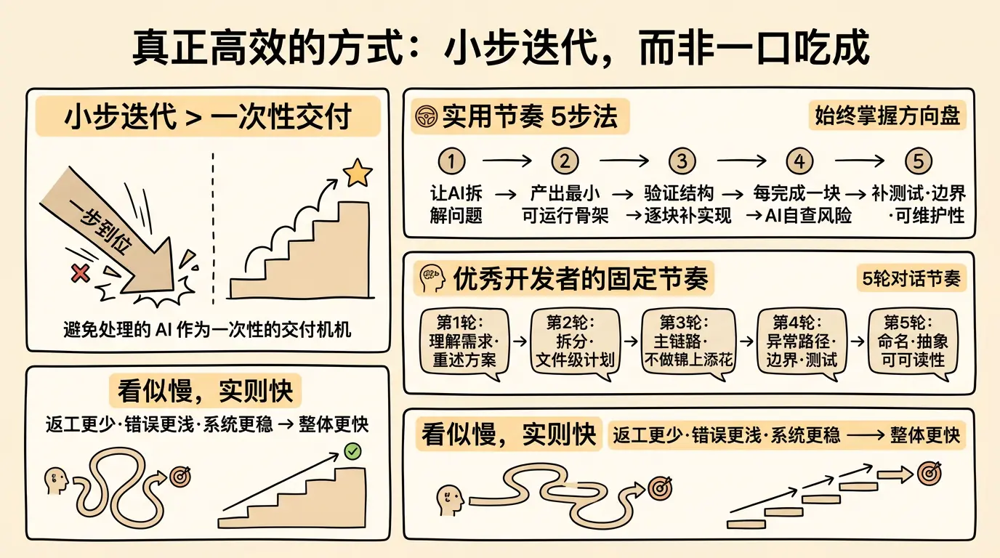

Vibe Coding 最容易踩的坑，就是把 AI 当作一次性交付机器。

这种心态会导致两个后果：要么你给出巨大而模糊的任务，结果 AI 生成一大片看似完整、实则难以接管的东西；要么你不停重来，每次都希望这次能一次到位，最后反而越来越乱。

更有效的方式，是把任务拆成可连续验收的小步。

一个很实用的节奏是：

1. 先让 AI 帮你拆解问题。
2. 再让它只产出最小可运行骨架。
3. 验证结构没问题后，再逐块补实现。
4. 每完成一块，就让 AI 自查风险和遗漏。
5. 最后再补测试、边界处理和可维护性整理。

这样做的好处是，你始终掌握方向盘。每一步的错误都能尽早暴露，每一轮对话也都更聚焦，AI 的输出质量会明显更稳定。

在实际工作里，很多优秀开发者已经形成了一种固定节奏：

- 第一轮：让 AI 理解需求并重述方案。
- 第二轮：让 AI 给出拆分和文件级计划。
- 第三轮：只做主链路，不做锦上添花。
- 第四轮：补异常路径、边界条件、类型和测试。
- 第五轮：回头整理命名、抽象和可读性。

这比直接一句帮我写完更慢吗？表面上似乎慢一点，但整体往往更快，因为返工更少，错误更浅，系统更稳。
