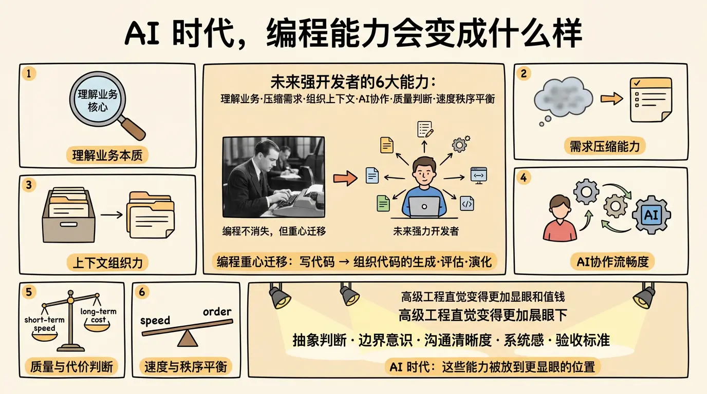

一个越来越明显的趋势是，未来的强开发者，未必是手写代码最快的人，而更可能是下面这几种能力都很强的人：

- 能快速理解业务本质。
- 能把模糊需求压缩成清晰任务。
- 能组织高质量上下文。
- 能与 AI 做连续、精细、低摩擦的协作。
- 能判断实现质量与长期代价。
- 能在速度和秩序之间找到平衡。

换句话说，编程不会消失，但它的重心会迁移。
如何写出代码仍然重要，但如何组织代码的生成、评估与演化会变得同样重要，甚至更重要。

从这个角度看，Vibe Coding 不是对工程能力的削弱，而是对工程能力的重新排序。那些过去藏在高级工程直觉里的能力，比如抽象判断、边界意识、沟通清晰度、系统感和验收标准，会在 AI 时代被放到更显眼的位置。
